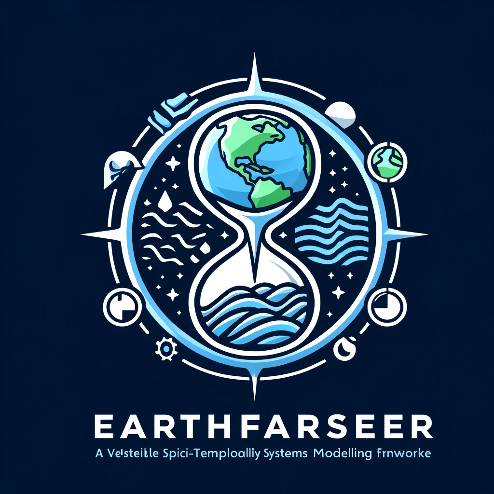

  

# Earthfarseer: Versatile Spatio-Temporal Dynamical Systems Modeling in One Model (AAAI2024)

<!--  -->

[📘Documentation](https://arxiv.org/abs/2312.08403) |
[🛠️Installation](docs/en/install.md) |
[🚀Model Zoo](https://arxiv.org/abs/2312.08403) |
[🤗Huggingface](https://arxiv.org/abs/2312.08403) |
[👀Visualization](https://arxiv.org/abs/2312.08403) |
[🆕News](docs/en/changelog.md)

### Getting Started

