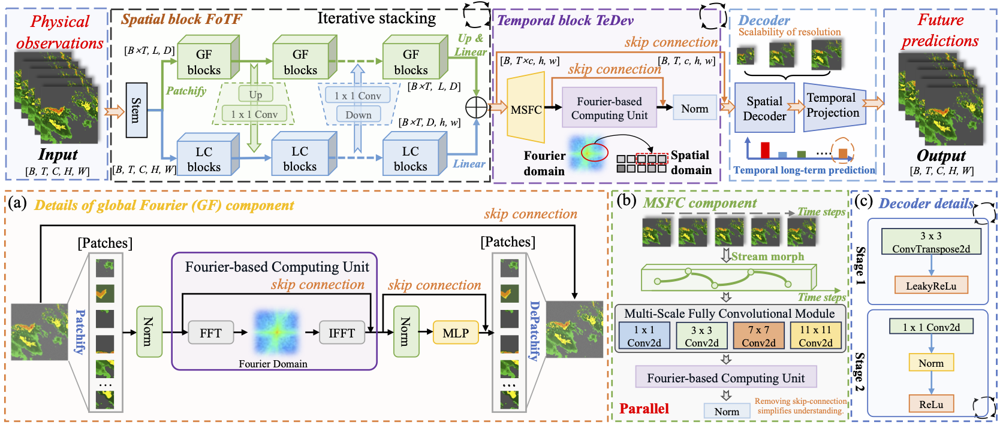

<p align="center" width="100%">
  
</p>


# Earthfarseer: Versatile Spatio-Temporal Dynamical Systems Modeling in One Model (AAAI2024)

<p align="left">
<a href="https://arxiv.org/abs/2312.08403" alt="arXiv">
    </a>
<a href="https://github.com/chengtan9907/OpenSTL/blob/master/LICENSE" alt="license">
    </a>
<!-- <a href="https://huggingface.co/OpenSTL" alt="Huggingface">
    </a> -->
<a href="https://openstl.readthedocs.io/en/latest/" alt="docs">
    </a>
<a href="https://github.com/chengtan9907/OpenSTL/issues" alt="docs">
    </a>
<a href="https://github.com/chengtan9907/OpenSTL/issues" alt="resolution">
    </a>
<a href="https://img.shields.io/github/stars/chengtan9907/OpenSTL" alt="arXiv">
    </a>
</p>


[📘Documentation](https://arxiv.org/abs/2312.08403) |
[🛠️Installation](docs/en/install.md) |
[🚀Model Zoo](https://arxiv.org/abs/2312.08403) |
[🤗Huggingface](https://arxiv.org/abs/2312.08403) |
[👀Visualization](https://arxiv.org/abs/2312.08403) |
[🆕News](docs/en/changelog.md)


##  NOTE: We use the concepts of VQ-VAE and memory to improve Earthfarseer and add more experiments. Currently, it is submitted to TPAMI 2024 as Earthfarseer-V2.

## Abstract
Efficiently modeling spatio-temporal physical processes presents a challenge for deep learning. Recent models often lack simplicity and practicality. To address this, we propose EarthFarseer, a concise framework combining parallel local convolutions and global Fourier-based transformer architectures. This approach dynamically captures local-global spatial interactions and dependencies. EarthFarseer also incorporates multi-scale fully convolutional and Fourier architectures for efficient temporal evolution. It demonstrates strong adaptability, fast convergence, and improved local fidelity in long-term predictions across various datasets, achieving state-of-the-art performance.


<p align="center" width="100%">
  
</p>


## Getting Started

1. Install Python 3.8. For convenience, execute the following command.

```bash
pip install -r requirements.txt
```


2. Prepare Data. You can obtain experimental datasets from the following links.


| Dataset       | Task                                    | Geometry        | Link                                                         |
| ------------- | --------------------------------------- | --------------- | ------------------------------------------------------------ |
| Navier-Stokes equation| Predict future fluid vorticity          | Regular Grid    | [[Google Cloud]](https://drive.google.com/drive/folders/1UnbQh2WWc6knEHbLn-ZaXrKUZhp7pjt-) |
| Shallow-water equations | Predict future fluid height          | Regular Grid    | [[Google Cloud]](https://darus.uni-stuttgart.de/dataset.xhtml?persistentId=doi:10.18419/darus-2986) |
| Moving MNIST| Predict future image          | Regular Grid    | [[Google Cloud]](https://www.cs.toronto.edu/~nitish/unsupervised_video/) |


3. Use the following instructions to quickly run the code.

```python
python train_main.py --data_path Dataset/NavierStokes_V1e-5_N1200_T20.mat --num_epochs 100 --batch_size 5
```
## Citation

If you are interested in our repository or our paper, please cite the following paper:

```
@inproceedings{wu2024earthfarsser,
  title={Earthfarsser: Versatile Spatio-Temporal Dynamical Systems Modeling in One Model},
  author={Wu, Hao and Liang, Yuxuan and Xiong, Wei and Zhou, Zhengyang and Huang, Wei and Wang, Shilong and Wang, Kun},
  booktitle={Proceedings of the AAAI Conference on Artificial Intelligence},
  volume={38},
  number={14},
  pages={15906--15914},
  year={2024}
}
```

## Contact

If you have any questions or want to use the code, please contact [easyluwu@tencent.com](mailto:easyluwu@tencent.com).

