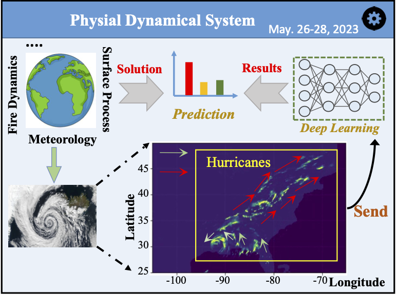
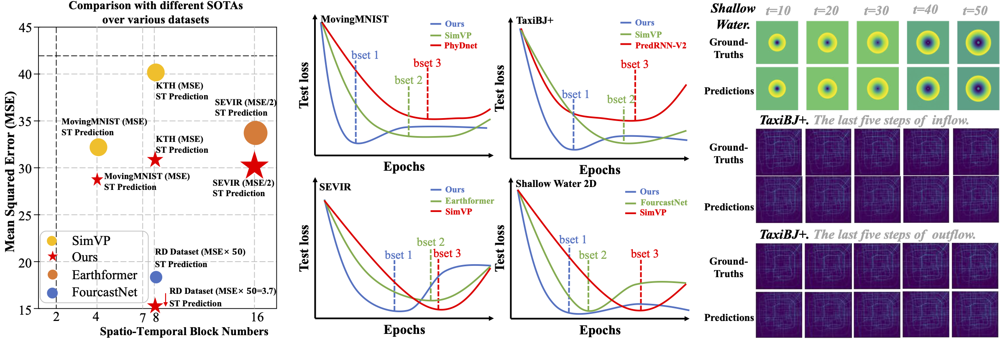
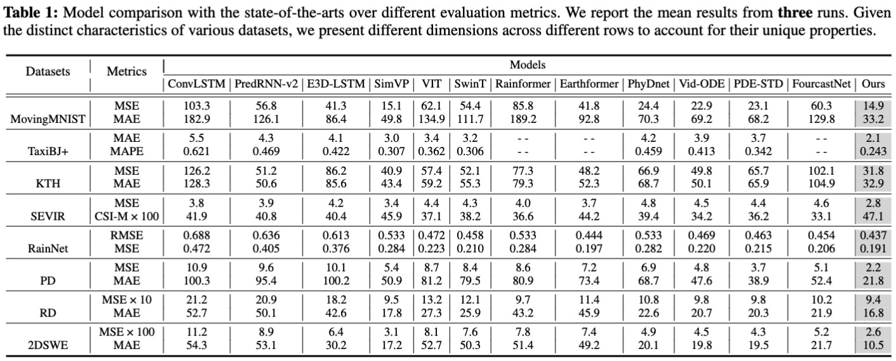

# EarthFarseer

### Getting Started
```
python main.py --epochs 100 --batch_size 16 --val_batch_size 16 --hid_S 64 --hid_T 128
```

## Introduction


<p align="center">
  
  <br>
  <sub><b><font face="Times New Roman">Figure 1:</font></b> A natural phenomenon in which global and local evolution are inconsistent. The hurricanes primarily exhibit clockwise rotation while in certain localized areas, the presence of convection results in the emergence of counterclockwise rotation.</sub>
</p>

<p align="center">
  
  <br>
  <sub><b><font face="Times New Roman">Figure 2:</font></b>Left. We showcase the performance comparisons between our model and SOTA models across diverse domains. Middle. Convergence of our model compared to other models across different datasets. Right. Our model demonstrates exceptional capability in addressing long-distance prediction problems. In Shallow Water, we leverage 10 frames to accurately forecast the next 50 frames, here we provide visualizations showcasing the results for the entire ten-frame sequence. In TaxiBJ+, we adopt 2 frames to predict the next 12 frames, and we can find our model excels at accurately reproducing both inflow and outflow results.</sub>
  
</p>

## Frameworks

<p align="center">
  
  <br>
  <sub><b><font face="Times New Roman">Figure 1:</font></b> Model overview.</sub>
</p>

## Experiments
### Main Table

<p align="center">
  
  <br>
  <sub><b><font face="Times New Roman">Figure 1:</font></b> Model overview.</sub>
</p>
